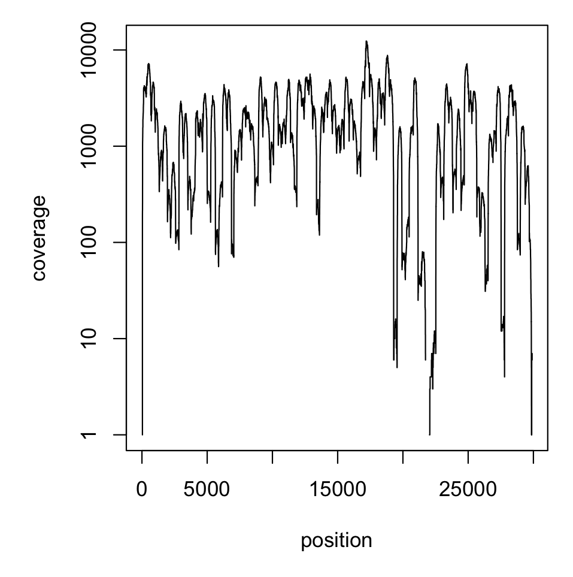

```{r setup, include=FALSE}
library("here") # All paths relative to the directory with a .git folder
    # here("scripts", "plots.R") will always find plots.R,
    # no matter where this rmd's working directory is
library(flexdashboard)
library(ggplot2)
```


<!-- ## Sourcing existing lineages -->

<!-- ```{r sourceascript, eval=FALSE} -->
<!-- source(here("scripts", "plot.R")) # won't run - files don't exist on my machine -->
<!-- ``` -->

# Background

* On November 23, 2021, a request for a new lineage designation was submitted to the CoV-lineages PANGO designation GitHub site, describing a new sub-lineage of B.1.1 sampled in Botswana, Hong Kong and South Africa with an excessive number of mutations.

* The request was reviewed and accepted on November 24, designating the new lineage as B.1.1.529.

* On November 26, the World Health Organization reclassified B.1.1.529 as a 'variant of concern' with designation 'Omicron'.

* On November 27, the CoV-lineages team uploaded a `constellation' file, describing a set of mutations for classifying genomes into the newly defined lineage.


# Analysis of Omicron mutations

We have the following objectives:

1. identify common mutations in lineage B.1.1.529 (Omicron) relative to the SARS-CoV-2 reference genome sequence (WH1);

2. determine which of these common mutations are unique to B.1.1.529, in comparison to all other defined lineages;

3. retrospectively screen all available wastewater sample data sets for the presence of these mutations.


## Prevalence of Omicron Mutations

```{r, echo = FALSE,fig.height=4.5}
omicron_v_pango = read.csv("compare-devan-art.csv")
omicron_v_pango$pango_freq = omicron_v_pango$pango_matches/220242
omicron_v_pango$`In Downstream Analysis` = omicron_v_pango$freq > 0.95 & omicron_v_pango$pango_freq < 0.05
omicron_v_pango$downstream = omicron_v_pango$`In Downstream Analysis`

plot <- ggplot(data = omicron_v_pango, mapping = aes(x = freq, y = pango_freq + 0.000005, label = mutation, color = `In Downstream Analysis`)) + geom_point() + xlab("Frequency in Omicron") + ylab("Frequency in Pango Lineages") + scale_y_log10()+ geom_jitter() + theme(legend.position="bottom", panel.background = element_blank(),  panel.grid.major = element_blank(),
panel.grid.minor = element_line(colour = "grey"), axis.line = element_line(colour = "black"), text = element_text(size = 8))+scale_color_manual(values=c("#999999", "#E69F00"))
plot
```

**Figure 1** Illustration of `r nrow(omicron_v_pango)` mutations found throughout 77 Omnicron genomes. Mutations used in downstream analysis were present in >95\% of Omicron genomes and <5\% of all other Pango lineages.

&nbsp;


From the `r nrow(omicron_v_pango)` mutations, we selected mutations present in >95\% of Omicron genomes and <5\% of all other Pango lineages for further downstream analysis (n=`r sum(omicron_v_pango$downstream)`) on existing data files. These mutations are shown in Table 1.


&nbsp;


\pagebreak
**Table 1** Mutations selected from Omicron mutations for downstream analysis of wastewater samples.


```{r, echo=FALSE}
omicron_mutations_used = omicron_v_pango[omicron_v_pango$downstream,]
omicron_mutations_used = omicron_mutations_used[,c(-1,-4, -5, -6, -7,-8,-9, -11,-12)]
colnames(omicron_mutations_used) = c("Mutation", "Frequency in Omicron", "Frequency in Pango Lineages")
omicron_mutations_used = omicron_mutations_used[order(omicron_mutations_used$`Frequency in Omicron`,decreasing = T),]
rownames(omicron_mutations_used) = NULL
knitr::kable(omicron_mutations_used)
```


## Omicron Mutation Coverage in Wastewater Samples


## Omicron Mutations Discovered in Wastewater Samples


```{r, echo=FALSE}
knitr::include_graphics("detection.pdf")
```

**Figure 3** Illustration of the frequency of selected Omicron mutations in wastewater samples. 

&nbsp;


<!-- Guelph Sample (naming convention?) -->
<!-- ========== -->


<!-- {data-width=250} -->
<!-- -------------------------------------------------- -->

<!-- ### Data Information -->

<!-- ```{r, echo=FALSE} -->
<!-- as.table(matrix(c("Collection Date", "SOme date", "collection location", "some location"), ncol = 2, byrow = T)) -->
<!-- ``` -->


<!-- -------------------------------------------------- -->

<!-- ### Reads Information -->


<!--  -->


<!-- ### Sequence Reads Analyzed -->
<!-- ```{r, echo=FALSE} -->
<!-- valueBox(400,icon = "ion-arrow-graph-up-right") -->
<!-- ``` -->


<!-- ### Mean Depth of Coverage -->

<!-- ```{r, echo=FALSE} -->
<!-- valueBox(500, icon = "ion-stats-bars") -->
<!-- ``` -->


<!-- Data Analysis -->
<!-- -------------------------------------------------- -->

<!-- ### Variants of Concern -->


<!-- Here we can add additional information currently I have variants of concern that have been found in a bar chart in their quantity -->

<!-- ```{r, echo=FALSE} -->
<!-- variants <- c("B.1.1.7","B.1.1.59", "A.1", "A.1", "A.1", "B.1.1.7") -->
<!-- variants <- data.frame(table(variants)) -->
<!-- ggplot(variants, aes(variants, Freq)) + geom_col() -->
<!-- ``` -->

